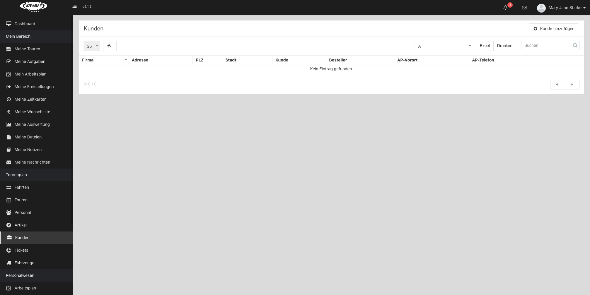
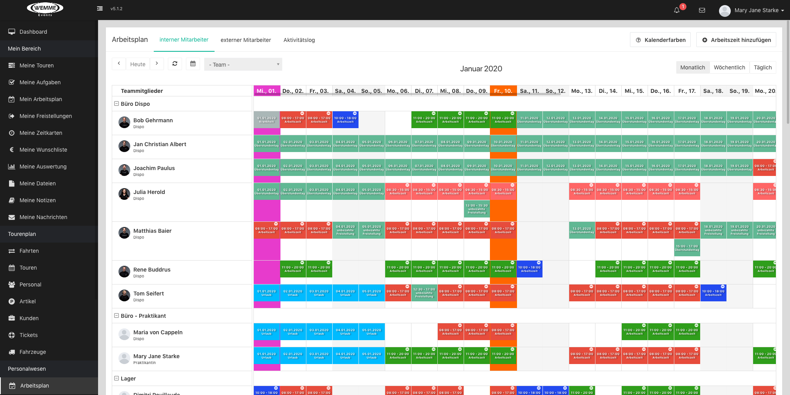

====== Mein Bereich ======

===== Meine Touren =====
**Hier hast du Einsicht in deinen Tourenkalender.**

Jede Tour erhält eine eigene **„Tour-Nr.“**, so kann sie schnell im Register in der Option **„Suchen“** gefunden werden.

Das Feld **„Datum“** gibt den Tag an , an dem die Tour stattfinden soll.

Die Spalten **„Beginn“** und **„Ende“** legen die Zeit fest, die dafür eingeplant wurde.

Jede Tour hat einen anderen Treffpunkt , dieser kann in der eigenen Firma oder bei einem Kunden sein.
Wo es stattfindet, kannst du unter der Option **„Treffpunkt“** finden.

In dem Bereich **„Position“** kannst du nachschauen, ob du für diese Tour eingeteilt wurdest.

Der **„Status“** zeigt an, ob deine Tour erledigt oder noch ausstehend ist.

**„Erledigt“** bedeutet, das der Auftrag abgelossen is.

**„Ausstehend“** bedeutet wiederum, dass der Auftrag noch nicht beendet wurde.

Wenn du auf das **„Icon“** bei  **„Informationen“** klickst, gelangst du auf die gewünschte Tour.

Du kannst die Tabelle unter Option **„drucken“** ausdrucken oder sie vorher per **„Excel“** öffnen und bearbeiten.

===== Meine Aufgaben =====

**Hier hast du Einsicht in deine Arbeitsprozesse.**

Du kannst mit dem Button **„Aufgaben hinzufügen“** neue Aufgaben anlegen.

Im **„Check-In“** Feld kannst du erledigte Aufgaben abhaken,

diese erscheinen dann in der Option **„Satus“** als **„Check-in".**

Unerledigte Aufgaben werden als **„ausstehend“** angezeigt.

Folgende Optionen kannst du mit dem **„Bleistift Icon“** auf der rechten Seite bearbeiten:

Um welches Event es sich handelt, wird in der Spalte **„Bezeichnung“** festgehalten.

Eine Feld **„Beschreibung“** ist vorgesehen für verschiedene Informationen rund um den Arbeitsablauf.

**„Teammitglieder“** ist eine Option in der das Personal hinzugefügt wird.

Das Anwesende Personal wird dir in der Option **„Anwesend“** mit dem jeweiligen Foto des Mitarbeiters angezeigt.

Das Feld **„Nicht Anwesend“** deutet mit dem dazugehörigen Foto darauf hin, wer an dem Tag nicht eingeteilt wurde.

Das Feld **„Dauer“** , **„Startdatum“** und **„Enddatum“** sind  dafür vorgesehen um den Zeitraum der Veranstaltung festzulegen.
Gewählt werden kann aus **„einem Tag“** oder **„mehrere Tage“**

Jeder Tag bekommt unter der Option **„Datum“** seine eigene Spalte.

**„Feiertage“** und **„wiederkehrende“** Ereignisse werden durch klicken in der Bearbeitung gefiltert.

**„Wiederholungen“** und **„bestimmte Wochentage“** können festgelegt werden.

Die in den **„Bearbeitungen“** festgelegte **„von / bis“** Aufgabenzeit Erscheint unter den Feldern  **„Beginn“** und **„Ende“** .

Dort wird vorgemerkt wieviel Zeit die Veranstaltung in Anspruch nimmt.

Zusätzlich kannst du wenn du auf **„Datei hochladen “** klickst dazugehörige Dokumente hochladen.

Du kannst die Tabelle unter Option **„drucken“** ausdrucken oder sie vorher per **„Excel“** öffnen und bearbeiten.
===== Mein Arbeitsplan =====

**Hier siehst du deine Schichten / Dienste im Kalender.**

Du kannst mit dem Button **„Arbeitszeiten hinzufügen“** neue Schichten / Dienste anlegen und diese mit der Option **„Kalenderfarben“** farblich hinterlegen.

Die Markierung dient zur unterscheidung verschiedener Ereignismöglichkeiten.

Gewählt werden kann zwischen **„Freistellungsarten" , "Diens,-Pausenzeiten" und "Feiertagen".**

Die **„Kalenderansicht“** und die **„Listenansicht“** zeigen immer die gleichen Termine.

Wenn du eine der beiden Ansichten änderst (z.B. Terminänderung) und auf die jeweils andere Ansicht umschaltest, hat sich auch dort der Termin geändert.

Hilfreich ist es daher daher geänderte Ereignisse in dem Feld **„Änderungsprotokoll“** einzutragen.

das folgende 3 Optionen beinhaltet :

**„Bearbeiter“** : wer hat etwas geändert ?

**„Bearbeitungsdatum“** : wann wurde es geändert ?

**„Bearbeitungsstatus“**: was wurde geändert ?

Du kannst den Kalender unter der Option **„drucken“** ausdrucken.

===== Meine Freistellungen =====

**Beantrage deine Freistellungen.**

Du kannst mit dem Button **„Freistellung hinzufügen“** deine Freistellungen beantragen.

Wähle deinen Grund zur Freistellung im Feld **„Freistellungsart “** aus.

Wenn du auf das **„Stift Icon “** zur Bearbeitung klickst kannst du auch dort die Freistellungsart hinzufügen.

Gewählt werden kann hier zwischen **„einem Tag“** , **„mehreren Tagen“** oder **„Stunden“** .

Ein **„Startdatum“** und **„Enddatum“**  legt fest, ab wann und bis wann du nicht verfügbar bist.

Das Feld **„Grund“** ist dafür vorgesehen, um Abwesenheitsanlässe zu hinterlegen.

Die **„Status“** Option zeigt den Bearbeitungsverlauf an.

Gewählt werden kann zwischen : **„In Bearbeitung",** **„abgelehnt“** ,**„Abgebrochen“** und **„genehmigt“**.

Diese erscheinen dann in der Option **„Satus“** (**z.B. wie hier grün markiert**) als genehmigt.

Zusätzlich kannst du wenn du auf **„Datei hochladen “** klickst dazugehörige Dokumente hochladen.

Du kannst die Tabelle unter Option **„drucken“** ausdrucken oder sie vorher per **„Excel“** öffnen und bearbeiten.

===== Meine Zeitkarten =====

**Erfasse deine Arbeits,-  und Ruhezeit**

Unter der Option **„Zeitkarte hinzufügen“**  kannst du deine Arbeits;- und Pausenzeiten hinzufügen.

Das Feld **„Datum“** gibt den Tag an ,für den die Eintragung vorgesehen ist.

Die Spalten **„Startzeit“** und **„Endzeit“** legen die Dienst zeit fest.

In das Feld **„Pausenzeit“** trägst du deine Ruhezeiten ein.

Der „Status“ zeigt an, ob deine Zeitkarte **genehmigt** oder noch nicht bearbeitet oder sogar **abgelehnt** oder bei Fehlern **abgebrochen**  wurde.

Mit dem  **„Stift Icon“** Können diese Bereiche überarbeitet werden.

Dort findest du auch die Option **„Datei hochladen“**,für eigene Dokumente.

Du kannst die Tabelle unter Option **„drucken“** ausdrucken oder sie vorher per **„Excel“** öffnen und bearbeiten.

===== Meine Wunschliste =====

**Beantrage dein benötigtes Arbeitsmittel**

Du kannst mit dem Button **„Wunsch hinzufügen“** hinterlegen, welches Material du benötigst.

Dort hälst du unter **„Ablaufdatum“** fest, bis wann du es spätestens benötigst.

In der Spalte **„Kategorie“** bestimmst du deine Abteilung.

Die möglichen Kosten werden unter der Option **„Betrag“** eingetragen.

Im **„Titel“** legst du fest, um welches Material es sich handelt.

Unter der Option **„Notiz“** kannst du eine Beschreibungen dazu hinzufügen.

Du kannst die Tabelle unter Option **„drucken“** ausdrucken oder sie vorher per **„Excel“** öffnen und bearbeiten.
===== Meine Auswertung =====

**Zusammenfassung deiner gesamten Dienstzeit**

Im Fenster **„Zeitraum“** wird dir das gesamte Jahr in einer Tabelle angezeigt.

Die Tabelle ist in einzelne Monate gegliedert.

Jeder Monat hat eine eigene Zeile.

Die Zeile ist gegliedert in 7 Spalten mit den Kathegorien :

**„Arbeitstage“** , **„Feiertag“**, **„Urlaubstage“** , **„IST - Stunden“**, **„Freistellungen“** , **„SOLL-stunden“** und **„Saldo“**.

In der Spalte **„Arbeitstage“**  findest du die Anzahl deiner geleisteten Arbeitstage des gesamten Monats.

Auch in der Spalte **„Feiertage“** und **„Urlaubstage“** wird die Anzahl der Feiertage und Urlaubstage des gesamten Monats aufgelistet.

Die Spalte **„IST-Stunden“** zeigt deine Arbeitszeit in Stunden an.

Die Kathegorie **„Freistellungen“** enthält die gesamte Auflistung der Stunden für die du eine Freistellung bekommen hast.

Aus dem ganzen ergeben sich die **„SOLL-Stunden“**, hier siehst du, wieviel Stunden du in dem jeweiligen Monat noch zu leisten hast.

Am Ende wird ein **„Saldo“** gebildet.

In dem Feld **„Gesamt“**, werden alle Tage und Stunden pro Spalte für das ganze Jahr zusammen gerechnet.

===== Meine Dateien =====

**Deine Persönlichen Dokumente**

In dieser Ansicht hast du die Möglichkeit per Mausklick auf den Button  **„Dateien hinzufügen“** deine persönlichen Dateien hochzuladen.

Im Feld **„Datei“** wird dir der Dateiname angezeigt .

Die Spalte **„Größe“** zeigt an wieviel Speicherplatz diese Datei benötigt.

Das **„Erstellungsdatum“** gibt an, an welchem Tag und zu welcher Uhrzeit du deine Datei hochgeladen hast.

Du kannst die Dateien über den **„Wolken Icon“** auch auf der Clod speichern.

Mit dem  Icon **„X“** löschst du deine vorhandenen Dateien.

Du kannst die Tabelle unter Option **„drucken“** ausdrucken oder sie vorher per **„Excel“** öffnen und bearbeiten.

===== Meine Notizen =====

**Verwalte deine Vermerke**

Hier hast du die Möglichkeit per Mausklick auf den Button  **„Notiz hinzufügen“** Notizen zu erstellen.

In der Spalte **„Titel“** kannst du deine Notizen benennen.

Das Feld **„Beschreibung“** dient dazu deine Erläuterung oder Stichpunkte hinzuzufügen.

Im Feld **„Datum“** und **„Beginn“** trägst du ein, für welchen Tag du die Notizen vorbereitet hast.

Du kannst auch neben der Status Kathegorie  zwischen mehereren Optionen wählen:

**„Heute“**, **„in 7 Tagen“**, **„in 15 Tagen“** oder **„Eigene“**.

Im **„Status“** wird festgelegt ob deine Notiz noch **„offen“** oder **„fertig“** ist.

Du kannst die Tabelle unter Option **„drucken“** ausdrucken oder sie vorher per **„Excel“** öffnen und bearbeiten.

===== Meine Nachrichten =====
**
Kommunikation via Email.**

Hier kannst du unter  **„Verfassen“** mit betriebsinternen Mitarbeitern kommunizieren.

In der Option **„An“** findest du eine vorgespeicherte Empfängerliste und deren Positionen , hier wird dir ermöglicht den gewünschten Empfänger auszuwählen.

In der **„Betreff“** - zeile kannst du deiner Mail einem Thema zuweisen,

Der Empfänger kann anhand deines Betreffs zuordnen um was es geht.

Darunter findest du ein Inhaltsfeld **„Nachricht schreiben“** , dort kanns du deine Mail formulieren.

Unter **„Datei hochladen“** ist dir die Möglichkeit gegeben Dokumente und Bilder hochzuladen und zu versenden.

Du findest in der Option  **„Posteingang“** deine empfangenen Mails  , du kannst auch unter **„Suche“** nach gewünschten Inhalten suchen.

Du kannst auch ältere Mails wieder aufrufen indem du den Monat und das Jahr änderst.

Gesendete Mails findest du unter **„Gesendet“**.

Auch dort kannst du nach Inhalten und älteren Mails suchen.

Im **„Papierkorb“**  findest du bereits gelöschte Nachrichten.

Ach hier kannst du wie auch bei allen anderen nach Inhalten und Mails suchen.

----

====== Tourenplan ======

===== Fahrten =====

**Anlegen von Fahrten und Tourenplanung**

Mit dem Button **„Freie Fahrt erstellen“** ist es möglich neue Fahrten anzulegen.

Mit einem Klick  ist es möglich zwischen **„Liefern“** und **„Abholung“** zu wählen.

**„Startdatum“**, **„Enddatum“** sowie “**Beginn“** und **„Ende“** legen den Zeitraum und Uhrzeiten der Fahrten fest.

Unter folgenden Optionen werden die Kundendaten gespeichert:

**„Firma" ,
"Anschrift",
"Adresse,
"Adresszusatz
"PLZ,
"Stadt",
"Land""
"Kunde"
"Besteller"
"AP-Vorort"
"AP-Telefon“**

Unter Transport wird das Gesamtgewicht des Fahrzeuges gewählt.

Der **„Radius“** gibt an in welchem Umfeld sich der Lieferweg befindet.

Unter “**Gewicht“**  wird das Gewicht des Materials eingetragen.

Im letzten Bereich **„Notizen“** gibt es die Möglichkeit Vermerke zu hinterlegen.

Eine andere Option ist **„Tour aus Fahrten erstellen"
**
In diesem Fenster sind folgende Einstellungen möglich:

**„Fahrzeug“** , in dieser Auswahl wird das Fahrzeug für die gewünschte Tour ausgewählt.

**„Startdatum ","Enddatum" "Beginn" "Ende“** gibt den Zeitraum und Uhrzeit für die Tour an.

Auf der linken Seite sieht man einen **„Stadtlan“** mit Streckenverlauf.

Eine Auflistung der **„aktuellen Mitarbeiter Verfügbarkeit“** erleichtert es, Personal den Touren zuzuorden.

Das Feld **„Spedition“** gibt zusätzlich die Möglichkeit zwischen **„Lieferung“** und **„Abholung“** zu wählen.

**„Mietvorgang“** und **„Verkaufsvorgang“** können bestimmt werden, indem man dies in der Option **„Vorgang“** auswählt.

In der Tabelle werden die Eingestellten Daten angezeigt.

Zusätzlich gibt es die Option Fahrten zu ergänzen, dafür benutzt man den **„Pfeil Icon“**

Mit dem Klick auf das **„Augen Icon“** ist es möglich seine Fahrten anzusehen.

In diesem Bereich ist es auch möglich die Berechnete Leistung zu sehen.
Gegliedert wird dieser Bereich unter folgenden Optionen:

**„Verkauf"
"Service"
"Transport"
"Versicherung"
"Sonderleistung"
"Rabatt"
"Kaution"
"Nettosumme"
"Mwst"
"Bruttosumme“**

Gespeichert wird die Tabelle indem man auf das **„Kästchen“** Links vor der Tabelle klick.

Die Tabelle kann unter der Option **„drucken“** ausdrucken oder vorher per **„Excel“** geöffnet und bearbeitet werden.

===== Touren =====

**Bearbeitung von Touren und Zuordnung des Personals**

Mit klick auf ** Tour hinzufügen** öffnet sich ein Fenster in dem man mit folgenden Optionen eine neue Tour erstellen kann.

**Tour -Nr.** Jede Tour erhält eine eigene Tour Nummer.

**Fahrzeug** Hier kann das Einsatzfahrzeug ausgewählt werden.

Mit der Option :

**Startdatum , Tourbeginn, Enddatum Tourende** legt man den Zeitraum und die Uhrzeit für den Tourzeitraum fest.

**Startadresse** und **Endadresse** geben den jeweiligen Ort an von denen Die Tour beginnt und endet.

In der Übersichtstabelle sind alle eingestellten Daten wieder zu finden.

Auch das jeweils eingeteilte Personal ist in der Spalte **Personal** einzusehen.

In der Spalte **Artikel** sind die Materialien zu finden, die man mit auf die Tour nimmt.

Platz für Vermerke ist in der Spalte **Notizen**.

Der Status gibt an ob die Tour **offen, Beendet, Pausiert** oder **abgebrochen** ist.

===== Personal =====

**Personal zuordnen oder bearbeiten.**

Mit dem **„Stift Icon“** kann dieser Bereich bearbeitet werden.

Nach dem öffnen des Fensters hat man folgende Optionen:

**„Personalnummer“** , jeder Mitarbeiter erhält eine eigene Personalnummer.

Unter ** "Startdatum“** und **„Enddatum“**  sowie **„Arbeitsbeginn“** und **„Arbeitsende“** wird ein Zeitraum und Uhrzeit der Mitarbeiter festgelegt.

In dem Feld Fähigkeit öffnet sich eine Liste in der die Qualifikation der Mitarbeiter ausgewählt werden kann.

Mitarbeiter selber wird unter dem Feld **„zuordnen“** eingegliedert.

Gelöscht werden kann der Komplette eintrag mit einem Klick auf der **„X“** Icon.

In der Ansicht ist es möglich zwischen **„Zugeordnete“** und **„nicht zugeordnete“** Mitarbeiter zu switchen.

unter der Option **„Zeitkarte hinzufügen“** kann Arbeits;- und Pausenzeiten hinzugefügt werden.

Das Feld **„Datum“** gibt den Tag an ,für den die Eintragung vorgesehen ist.

Die Spalten **„Startzeit“** und **„Endzeit“** legen die Dienst zeit fest.

In das Feld **„Pausenzeit“** trägst du deine Ruhezeiten ein.

Der **„Status“** zeigt an, ob deine Zeitkarte genehmigt oder noch nicht bearbeitet oder sogar abgelehnt oder bei Fehlern abgebrochen wurde.

Mit dem **„Stift Icon“** Können diese Bereiche überarbeitet werden.

Dort findet man auch die Option **„Datei hochladen“**,für eigene Dokumente.

Der Status gibt an, ob es **„bearbeitet“** oder **„noch offen“** ist.

Die Tabelle kann unter der Option **„drucken“** ausdrucken oder vorher per „Excel“ geöffnet und bearbeitet werden.

===== Artikel =====

**Artikel zuordnen und bearbeiten**

Anzahl, Bezeichnung , Datum,

Mit dem **„Stift Icon“** kann dieser Bereich bearbeitet werden.

In diesem Fenster gibt es folgende Optionen.

Die **„Artikel Nummer“** : Jeder Artikel erhält eine eigene Artikel Nummer , die dort eingegeben wird.

Das **„Startdatum“** und  **„Enddatum“** sowie der  **„von“** und  **„bis“** Bereich legen das Zeitfenster fest  in der die Artikel den Touren zugeordnet sind.

Man legt mit dem **„Titel“** eine Benennung der jeweiligen  Tour fest.

In dem Feld **„Anzahl“** wird eingetragen wieviele Produkte in diesem Zeitraum unterwegs sind.

Eine  **„Index Nr.“** und **„Epi Nr.“** werden ebenfalls zugeteilt.

Man kann in dem Auswahl Filter den aktuellen Monat und das Jahr bestimmen.

Die Tabelle kann unter der Option **„drucken“** ausdrucken oder vorher per **„Excel“** geöffnet und bearbeitet werden.
===== Kunden =====

**Verwaltung von Firmenkontakten**

Per Klick auf** "Kunde hinzufügen“**,können neue Kundenkontakte aufgenommen werden.

In dem anschliessend geöffneten Fenster stehen folgende Optionen zur Auswahl:

**„Firma","Anschrift", "Adresse","Adresszusatz", "PLZ",
"Stadt","Land",**

**„Kunde“** , **„Besteller", "AP vor Ort**(Ansprechpartner), **AP Telefon**

Im **Auswahlfilter** sind die Kunden alphabetisch sortiert.

Die Tabelle kann unter der Option **„drucken“** ausdrucken oder vorher per **„Excel“** geöffnet und bearbeitet werden.

===== Tickets =====

**Erfassen, beheben und optimieren von Konflikten**

Mit Hilfe des **„Stift Icons“**  öffnet sich ein Bearbeitungsfenster.

In diesem Bereich stehen folgende Optionen zur Verfügung:

**„Titel", "Fahrt", "Ticket - Typ","Zuordnen zu", "Labels“**

Der **„Titel“** ist der Bereich in dem das Ticket benannt wird,

Der Bereich **„Fahrt“** dient zur Eingabe der Adresse des Veranstaltungsortes an dem es Konflikte gab.

Im Auswahlfilter **„Ticket-Typ“** kann bestimmt werden , ob es sich um den **„Aufbau", "Abbau“** oder **„Support“** handelt.

Um einen Mitarbeiter zuzuordnen öffnet sich unter der **„Zuordnen zu“** ein Auswahlfilter.

Im Bereich** "Labels“** kann zwischen **„nicht wichtig, aber dringend“** und **„nicht wichtig, nicht dringend“** gewählt werden.

Die Tabelle kann unter der Option **„drucken“** ausdrucken oder vorher per **„Excel“** geöffnet und bearbeitet werden.

===== Fahrzeuge =====

**Informationen der Fahrzeuge**

Hier ist es möglich sich mit dem Button **„Fahrzeug hinzufügen“** die Fahrzeuge der jeweiligen Touren hinzuzufügen.

Das Fenster ist eingeteilt in verschiedenen Optionen zum hinzufügen der Autodetails:

**„Fahrzeugbild“**, wo das jeweilige Foto des Fahrzeuges der Tour hinzugefügt werden kann.

**„Fahrzeug ID“** , dort wird die Fahrzeug Identifikationsnummer zugeteilt.

**„Fahrzeugname**, **„Hersteller“** und **„Modell“** und **„Kennzeichen“**.

Unter **„Eigentum“** und **„Miete“** kann gewählt werden zwischen **„Firmenwagen“** und **„Mietwagen“**.

In der Option **„Sitzplätze“** kann gewählt werden zwischen **„1- 7“** Sitzplätze.

**„Ladevolumen“** gibt das Volumen in m3 an.
Die **„Zuladung“** das zugeladene Gewicht in Kg.

Klickt man auf die Optionen **„Verfügbar von“** und **„Verfügbar bis“** öffnet sich ein Kalenderfenster im dem Tag und Uhrzeit für den Zeitraum eingetragen werden kann.

**„Kilometerstand“** sind die Einstellungen indem der Kilometerstand am jeweils ausgewählten Tag eingegeben wird.

Den Tag kann man mit der Option **„Kilometerstand am “** in dem Kalenderfenster auswählen.

Ein Kalenderfenster öffnet sich ebenfalls in  den Optionen  :

**„Nächster TÜV HU/AU“** und **„Sicherheitsüberprüfungen ab 12 t
(6 Monate später wie der TÜV)“** in denen das jeweilige Darum dafür eingetragen wird.

Versicherungsinformationen können unter :

**„Versicherungsname“**
**„Versicherungsnummer“**
**„Kaskoversicherung“** ausgefüllt werden.

In der Textbox **„Kaskoversicherung“** kann wischen **„ohne“**, **„Teilkasko“** und **„Vollkasko“** gewählt werden.

Die Maße des Fahrzeuges können in folgenden Feldern gewählt werden:

**„Abmessungen“** ,**„Ladefläche“** und **„Ladeluke“**.
In diesen Einstellungen können **„Länge, Höhe und Breite“** des Fahrzeuges in cm festgelegt werden.

**„Hängelast gebremst“** und **„Hängelast ungebremst“** werde in Kg eingetragen.

Die Optionen **„Sicherheitsüberprüfung** und **„UVV Prüfung Ladeboardwand“** geben die Möglichkeit diese Prüfungstage in den Kalender einzutragen.

**„Leermasse G“**  ist das Leergewicht, auch Leermasse genannt, ist die nach festgelegten Maßstäben ermittelte Masse eines technischen Objekts, die dort eingetragen werden kann.

**„Zul. Gesamtmasse“** Ist die zulässige Gesamtmasse (zGM), sie bezeichnet die Summe aus Leergewicht plus maximaler Zuladung eines Kraftfahrzeuges oder einer Fahrzeugkombination. Diese kann dort eingetragen werden.

In der Option **„Verantwortlicher“** wird der jeweilige zugeordnete Mitarbeiter hinzugefügt.

**„Bemerkungen“** Hier können Informationen hinzugefügt werden.

**„Status Aktiv Inaktiv“** gibt an, ob das Fahrzeug einsetzbar ist.

Dokumente wie Fahrzeugscheine o.ä. können mit klick auf **„Datei hochladen“** hochgeladen und gespeichert werden.

Mit dem **„Stift Icon“** können alle Optionen bearbeitet werden.

Die Tabelle kann unter der Option **„drucken“** ausdrucken oder vorher per **„Excel“** geöffnet und bearbeitet werden.

====== Personalwesen ======

===== Arbeitsplan =====

**Hier sind Schichten / Dienste im Kalender zu sehen**

Hier ist es möglich sich mit dem Button **„Team“** die Schichten/ Dienste  der jeweiligen MitarbeiterSchichten / anzeigen zu lassen.
Gegliedert ist dieser Reiter in :

**„Büro Dispo“**,
**„Büro Praktikant“**,
**„Lager“**,
**„Lager- Azubi“**,
**„Lager-Praktikant“**,
**„Logistik“**

Diese sind Farblich hinterlegt.
In dem Hilfefenster **„Kalenderfarben“** , findet man eine ausführliche Erklärung zu den Farben.

Dort sieht man als erstes 5 verschiedene Spalten :
**„Schicht“**, **„Arbeitszeiten“**, **„Frühstückspause“**, **„Mittagspause“**, **„Stunden“**

Gewählt werden kann zwischen verschiedenen **„Freistellungsarten“**:

**Ausgleichstag"“**, **„Krankheit“**, **„Elternzeit“**,**„Überstundentag“**,**Krankheit des Kindes“**, **„Mutterschutz“**, **„Unbezahlte Freistellung“**; **„Urlaub“**

Und im nächsten Abschnitt **„Feiertage“**
Die **„Kalenderansicht“** kann in **„Monatsansicht“**, **„Wochenansicht“** und **„Tagesansicht“** geändert werden.

In dem Feld Teammitglieder werden die eingeteilten Mitarbeiter und deren entsprechenden Positionen angezeigt.

Die Tabelle kann unter der Option **„drucken“** ausdrucken oder vorher per **„Excel“** geöffnet und bearbeitet werden.
===== Freistellungen =====

**Beantragung von Freistellungen**

Hier ist es möglich  unter der Option **„Freistellung“** hinzufügen eine Freistellung einzutragen.

Bei der Ansicht der Freistellungen  kann zwischen **„monatlich und jährlich “** gewählt werden.
Der **„Aktivitätslog“** zeigt an welche Freistellungen gerade aktuell sind.

Die Ansicht ist in 8 Spalten gegliedert.

**„Teammitglied, Freistellungsart , Datum, Dauer, Status, ,Datei, Notiz, Bearbeiten“**

**„Teammitglied“** ist der jeweilige Mitarbeiter, der eine Freistellung beauftragt hat.
die **„Freistellungsart“** zeigt den Grund an, weswegen er vom Dienst befreit werden möchte.
Die Option **„Datum“** und **„Dauer“** legt den Zeitraum für die Freistellung fest.

Der **„Status“** zeigt an in welchem Bearbeitungsverlauf sich die Freistellung momentan befindet.

In dem Feld **„Datei“** können Dokumente in der Freistellung angehangen werden . z.B. Krankenschein o.ä.

Es kann unter der Option **„Notiz“** ein Vermerk hinterlegt werden.

Im Bearbeitungsbereich **„Stift Icon“** können die vorigen Infos überarbeitet werden.

Die Tabelle kann unter der Option **„drucken“** ausdrucken oder vorher per **„Excel“** geöffnet und bearbeitet werden.

===== Zeitkarten =====

**Hier können Arbeits und Ruhezeiten erfasst werden.**

Unter der Option **„Zeitkarte hinzufügen“** kann Arbeits;- und Pausenzeiten hinzufügen.

In dem Feld **„Teammitglied“** kann der jeweilige Mitarbeiter ausgewählt werden , in dessen Zeitkarte man sich einen Überblicke verschaffen möchte.

Das Feld **„Datum“** gibt den Tag an ,für den die Eintragung vorgesehen ist.

Die Spalten **„Startzeit“** und **„Endzeit“** legen die Dienstzeit fest.

In das Feld** „Pausenzeit“** findet man Platz für die Ruhezeiten.

Der **„Status“** zeigt an, ob Zeitkarten genehmigt, nicht bearbeitet, abgelehnt oder bei Fehlern abgebrochen wurden.

Unter der Option **„Datei hochladen“** können eigene Dokumente hochgeladen werden

Die Tabelle kann unter der Option **„drucken“** ausdrucken oder vorher per **„Excel“** geöffnet und bearbeitet werden.
===== Wunschliste ====

**Beantragung von benötigten Arbeitsmaterial**

Mit dem Button **„Wunsch hinzufügen“** kann Material welches benötigt wird hinterlegt werden.

Dort wird unter **„Ablaufdatum“** festgehalten, bis wann es spätestens benötigt wird.

In der Spalte** „Kategorie“** wird die Abteilung bestimmt.

Die möglichen Kosten werden unter der Option **„Betrag“** eingetragen.

Im **„Titel“** legt man fest, um welches Material es sich handelt.

Unter der Option **„Notiz“** kann man eine Beschreibungen dazu hinzufügen.

Die Tabelle kann unter der Option **„drucken“** ausdrucken oder vorher per **„Excel“** geöffnet und bearbeitet werden.

===== Freiberufler ====

**Verwaltung der Freiberufler**

In dieser Ansicht bekommt man einen Arbeitsplan der Freiberufler und dessen Verfügbarkeit zu sehen.

Unter der Option **heute** kann der gewünschte Tag gewählt werden.

Einen Klick auf das **Kalender Symbol** zeigt den aktuellen Monat an.

In dem Fenster **Fähigkeit** kann die jeweilige Fähigkeit des Mitarbeiters ausgewählt werden.

Alle Mitarbeiter mit dieser Fähigkeit werden dann angezeigt

Die Position des Mitarbeiters kann unter der Option **Position** ausgewählt werden.

Hier kann gewählt werden zwischen, **Freiberufler** und **Vip- Freiberufler.**

Die Ansicht kann in **wöchentlich**, **monatlich** und **täglich** gewechselt werden.

===== Aufgaben =====

**Einsicht in die Arbeitsprozesse.**

Im **„Check-In“** Feld können erledigte Aufgaben abgehakt werden, diese erscheinen dann in der Option **„Status“** als **„Check-in“**.

Unerledigte Aufgaben werden als **„ausstehend“** angezeigt.

Diese Option gewährt auf folgende Bereiche Einblick:

Um welches Event es sich handelt, wird in der Spalte **„Bezeichnung“** festgehalten.

Eine Feld **„Beschreibung“** ist vorgesehen für verschiedene Informationen rund um den Arbeitsablauf.

**„Teammitglieder“** ist eine Option in der das Personal hinzugefügt wird.

Das Anwesende Personal wird in der Option **„Anwesend“** mit dem jeweiligen Foto des Mitarbeiters angezeigt.

Das Feld **„Nicht Anwesend“** deutet mit dem dazugehörigen Foto darauf hin, wer an dem Tag nicht eingeteilt wurde.

Das Feld **„Datum“** und **„Beginn“** , **„Ende“** sind dafür vorgesehen um den Zeitraum der Veranstaltung festzulegen.

Jeder Tag hat unter der Option **„Datum“** seine eigene Spalte.

Die festgelegte Aufgabenzeit Erscheint unter den Feldern „Beginn“ und „Ende“ .

Dort wird vorgemerkt wieviel Zeit die Veranstaltung in Anspruch nimmt.

Zusätzlich ist es möglich, wenn man auf **„Datei hochladen“** klickt dazugehörige Dokumente hochladen.

Unter dem **„Augen Icon“** kann man alle Infos einsehen.

Die Tabelle kann unter der Option **„drucken“** ausdrucken oder vorher per **„Excel“** geöffnet und bearbeitet werden.

----

====== Verwaltung ======

===== Teammitglieder =====

**Anlegen einer Mitgliederdatei**

Hier ist eine Tabelle mit 5 einzelnen Spalten zu finden.

Jede Zeile Beinhaltet die Daten eines Mitarbeiters.

De erste Spalte ist gefüllt mit den Bildern der jeweiligen Mitarbeitern.

Unter der Option **Name** ist der Name des Mitarbeiters zu sehen.

Gleich daneben findet man di Option **Email** mit der Mailadresse des jeweiligen Mitarbeiters.

In der Spalte **Telefon** ist die Festnetznummer und in der Spalte **Mobil** die Handynummer des Mitarbeiters zu finden.

Wenn man nur eine bestimmte Gruppe der Mitarbeiter angezeigt bekommen möchte, kannmal dies unter der Option **Team** auswählen.

Dort kann zwischen folgenden Gruppen gewählt werden :

**Büro Dispo , Büro Praktikant, Lager, Lager Azubi, Lager Praktikant,Logistik, Techniker, Techniker Azubi,Helfer, Techniker Praktikant,Buchhaltung , Reinigung**

Es kann zwischen **Aktive Mitglieder** und **Inaktive Mitglieder** gewählt werden.

Die Position kann gewählt werden zwischen : **Mitarbeiter, Freiberufler** und **Vip- Freiberufler**

In der **Suche** kann man auch nach Mitgliedern suchen.

Die Tabelle kann unter der Option **„drucken“** ausdrucken oder vorher per **„Excel“** geöffnet und bearbeitet werden.

===== Ankündigungen =====

**Bekanntgabe der bevorstehenden Ereignisse**

Unter der Option **Ankündigung hinzufügen** ist die Möglichkeit gegeben Neuigkeiten, seinen Teammitgliedern mitzuteilen.

Der **Titel** ist die Bezeichnung des jeweiligen Vermerkes.
Unter **Erstellungsdatum** ist zu sehen, wann der Beitrag erstellt wurde und unter der Option **Erstellt von** ist hinterlegt, welches Teammitglied der Ersteller der Neuigkeiten ist.

===== Aktivitätslog =====

Protokoll

Hier findet man ein Änderungsprotokoll aller Aktivitäten und Veränderungen.

Dies ist eine Aufzeichnung von Änderungen an einem Projekt, oder einer Software.

